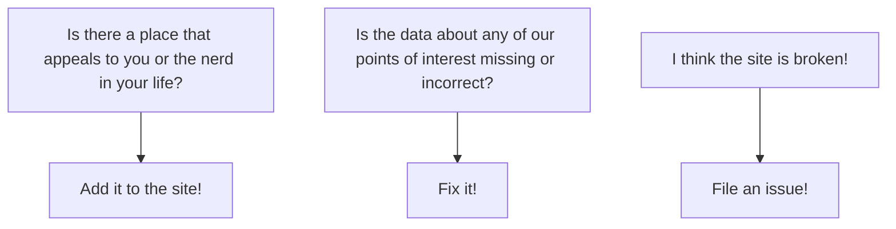

# Nerdy Day Trips

(logo)

&nbsp;
&nbsp;
<!-- 
&nbsp;-->

&nbsp;

[NerdyDayTrips.org](https://nerdydaytrips.org/) aims to create a global map of places to visit that might appeal to nerdy types. The open source data is crowd-sourced in this repository. The website is regularly built using this data.

Visit [NerdyDayTrips.org](https://nerdydaytrips.org/) to see the map.

*The project is intended as a reboot and spiritual successor to a defunct project of the same name, launched in 2011 by [Dr Ben Goldacre](https://www.badscience.net/).*

## Project Goal

Create a dynamic, sustainable, and accessible map showing places to go, and things to do for nerds.

## How it works

This repository on GitHub contains a file for each place shown on the map. A GitHub action deploys the main [NerdyDayTrips.org](https://nerdydaytrips.org/) website and the [NerdyDayTrips blog](https://nerdydaytrips.org/blog/) periodically - when there are changes made.

## Contributing

[NerdyDayTrips.org](https://nerdydaytrips.org/) needs you! 

## Background

Originally **Nerdy Day Trips** (at `http://www.nerdydaytrips.com`) [was](https://web.archive.org/web/20250000000000*/http://www.nerdydaytrips.com/) (Internet archive link) a website creation of Dr Ben Goldacre in 2011. It was a crowd-sourced database of "nerdy" places to go. The site was built as a frontend to an editable Google Map.

Upon visiting the site, users would see a large Google Map with pins dotted around the world, indicating the locations of "nerdy" places. Visitors could navigate around the map, and click the pins to get details about each location. The data was crowd-sourced, so anyone could add nerdy places to the database.

The website went down in 2016. There are some captures of the data on the [Internet Archive](https://web.archive.org/web/20250000000000*/http://www.nerdydaytrips.com/), but the dataset there is incomplete.

## Thanks

Thanks to [Dr Ben Goldacre](https://www.badscience.net/), [Applecado](http://www.applecado.co.uk/), [Aaron Rudd](http://www.aaronrudd.co.uk/), who developed the original site, and [Jo Brodie](https://howtodotechystuff.wordpress.com/) for [inspiring](http://brodiesnotes.blogspot.com/2010/10/abandoned-britain-half-day-nerd-trips.html) it to be created in the first place. Thanks also to the numerous contributors who contributed data to the original site.
