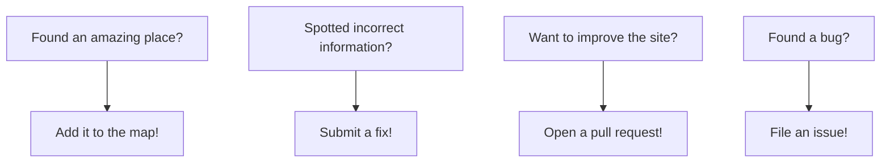

# Nerdy Day Trips

(logo)

<p align=center>
&nbsp;<a href="" target="_blank"></a>
&nbsp;
<!-- <a href="https://discord.gg/" target="_blank"></a>
&nbsp;-->
<a rel="me" href="https://mastodon.social/@nerdydaytrips"></a>
&nbsp;
<a rel="me" href="https://bsky.app/profile/nerdydaytrips.bsky.social"></a>
</p>

**Building a global map of fascinating places for curious minds.**

[NerdyDayTrips.org](https://nerdydaytrips.org/) is an open-source project creating a crowd-sourced database of museums, laboratories, observatories, maker spaces, historical sites, and other destinations that spark intellectual curiosity. Think of it as a treasure map for lifelong learners.

🗺️ **[Explore the map →](https://nerdydaytrips.org/)**

[](https://nerdydaytrips.org/)

*This project serves as a modern reboot and spiritual successor to the original Nerdy Day Trips, launched in 2011 by [Dr Ben Goldacre](https://www.badscience.net/).*

## 🎯 Mission

Create a dynamic, sustainable, and accessible map showing fascinating places to explore for curious minds everywhere.

## 🏗️ Architecture

- **Frontend**: [Hugo](https://gohugo.io/) static site generator
- **Mapping**: Leaflet.js for interactive maps
- **Data**: Markdown files for each location
- **Hosting**: Deployed automatically to Cloudflare Pages

## 🚀 Contributing

We'd love your help making this the ultimate guide to nerdy destinations!



### Quick Start for Contributors

1. **Add a location**: Use our [web form](https://add.nerdydaytrips.org) or create a markdown file in `/content/places/`
2. **Fix data**: Edit existing markdown files and submit a PR
3. **Improve code**: Check our [issues](https://github.com/nerdydaytrips/website/issues) for ways to help
4. **Enhance design**: We welcome CSS and UX improvements!

### Development Setup

```bash
git clone https://github.com/nerdydaytrips/website.git
cd website
hugo server
```

Visit `http://localhost:1313` to see your local version.

## 📊 Current Status

- ✅ Core functionality working
- 🔄 Actively adding locations
- 🎨 Theme improvements in progress
- 📱 Mobile optimization ongoing

Check our [issues](https://github.com/nerdydaytrips/website/issues) to see what we're working on!

## 🌟 Background

The original **Nerdy Day Trips** was created by Dr Ben Goldacre in 2011 as a crowd-sourced Google Maps frontend. It featured locations worldwide where curious people could explore science museums, historical sites, observatories, and other intellectually stimulating destinations.

When the original site went offline in 2016, much of the community's contributed data was lost. This project aims to rebuild and improve upon that vision with modern, sustainable technology.

## 🙏 Acknowledgments

Huge thanks to:
- [Dr Ben Goldacre](https://www.badscience.net/) for the original vision
- [Applecado](http://www.applecado.co.uk/) and [Aaron Rudd](http://www.aaronrudd.co.uk/) for developing the original site
- [Jo Brodie](https://howtodotechystuff.wordpress.com/) for [inspiring](http://brodiesnotes.blogspot.com/2010/10/abandoned-britain-half-day-nerd-trips.html) the project
- All the contributors to the original site
- Everyone helping to rebuild this community resource

## 📄 License

This project is licensed under the Apache License 2.0 - see the [LICENSE](LICENSE) file for details.