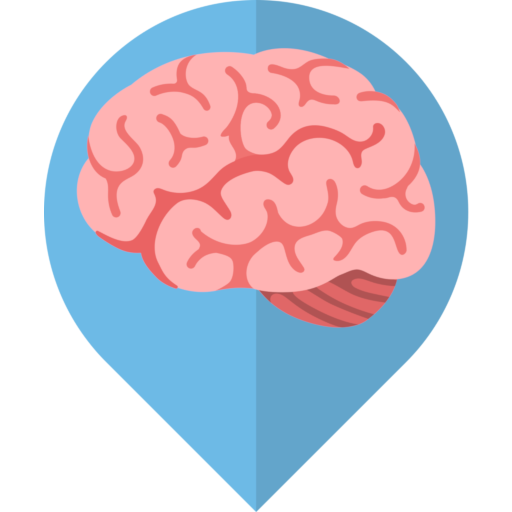
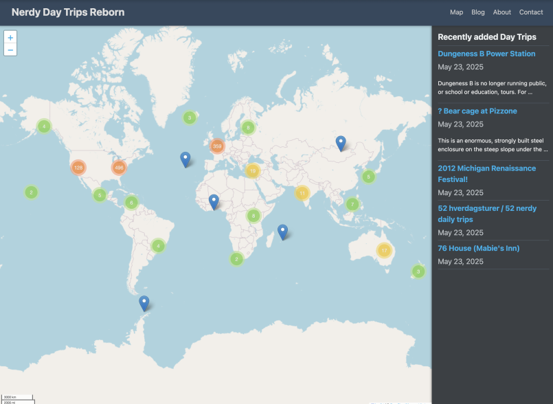

# Nerdy Day Trips

<p align=center>
<a href="https://nerdydaytrips.org" target="_blank"></a>
<br>
&nbsp;<a href="https://choosealicense.com/licenses/apache-2.0/" target="_blank"></a>
&nbsp;
<a rel="me" href="https://mastodon.social/@nerdydaytrips"></a>
&nbsp;
<a rel="me" href="https://bsky.app/profile/nerdydaytrips.bsky.social"></a>
</p>

**A crowd-sourced map of fascinating places for curious people.**

[NerdyDayTrips.org](https://nerdydaytrips.org/) is an open-source project mapping museums, laboratories, observatories, maker spaces, historical sites, and other destinations worth visiting if you're curious about the world.

🗺️ **[Explore the map →](https://nerdydaytrips.org/)**

[](https://nerdydaytrips.org/)

*This is a modern reboot of the original Nerdy Day Trips, launched in 2011 by [Dr Ben Goldacre](https://www.badscience.net/).*

## What we're doing

Building a sustainable, accessible map of interesting places to visit around the world.

## How it's built

- **Frontend**: [Hugo](https://gohugo.io/) static site generator
- **Mapping**: Leaflet.js for interactive maps
- **Data**: Markdown files for each location
- **Hosting**: Deployed automatically to Cloudflare Pages

## Contributing

We need help adding locations and improving the site.

### Ways to contribute

1. **Add a location**: Use our [web form](https://add.nerdydaytrips.org) or create a markdown file in `/content/daytrip/` (organized by continent/country)
2. **Fix data**: Edit existing markdown files and submit a PR
3. **Improve code**: Check our [issues](https://github.com/nerdydaytrips/website/issues) for tasks
4. **Enhance design**: CSS and UX improvements welcome
5. **Join discussions**: Participate in our [GitHub Discussions](https://github.com/nerdydaytrips/website/discussions) or [Discord server](https://discord.gg/VJKJ5EzgXA)

### Development setup

```bash
git clone https://github.com/nerdydaytrips/website.git
cd website
hugo server
```

Visit `http://localhost:1313` to see your local version.

## Current status

- ✅ Core functionality working
- 🔄 Actively adding locations
- 🎨 Theme improvements ongoing
- 📱 Mobile optimization in progress

Check our [issues](https://github.com/nerdydaytrips/website/issues) to see what we're working on.

## Background

Dr Ben Goldacre created the original Nerdy Day Trips in 2011 as a crowd-sourced Google Maps frontend. Through it, people could find and share science museums, historical sites, observatories, and other interesting destinations worldwide.

When the original site went offline in 2016, much of the community's contributed data was lost. This project rebuilds and improves on that concept using modern, sustainable technology.

## Acknowledgments

Thanks to:
- [Dr Ben Goldacre](https://www.badscience.net/) for the original vision
- [Applecado](http://www.applecado.co.uk/) and [Aaron Rudd](http://www.aaronrudd.co.uk/) for developing the original site
- [Jo Brodie](https://howtodotechystuff.wordpress.com/) for [inspiring](http://brodiesnotes.blogspot.com/2010/10/abandoned-britain-half-day-nerd-trips.html) the project
- All the original contributors
- Everyone helping rebuild this resource

## License

This project is licensed under the Apache License 2.0 - see the [LICENSE](LICENSE) file for details.
